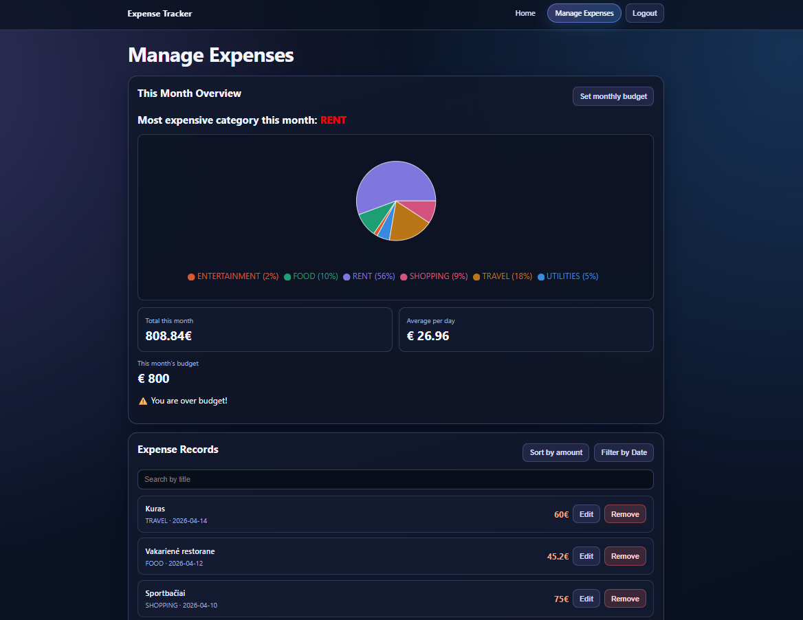
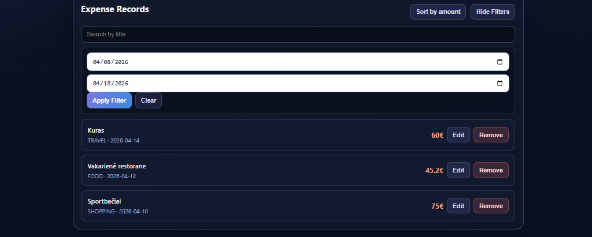
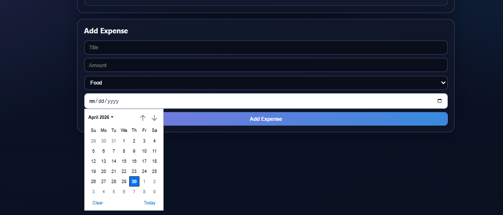
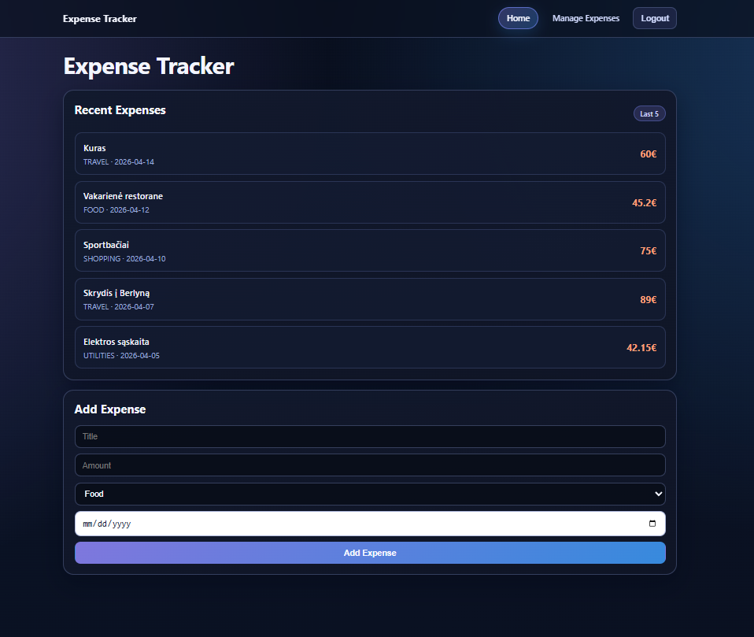
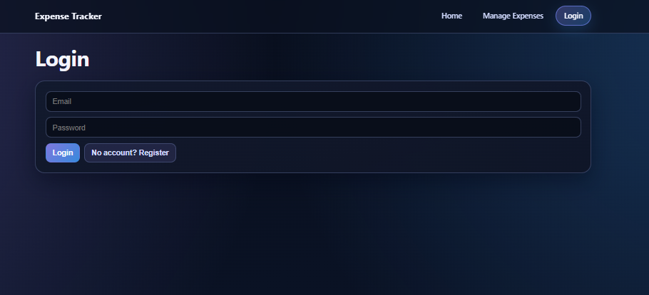

# Expense Tracker
A full-stack expense tracking application built with **Spring Boot** (backend) and **React + Vite** (frontend).

## Features
- User authentication with JWT (`register`, `login`, `me`)
- Per-user data isolation (each user only sees their own expenses and budget)
- Add, edit, delete, and view expenses
- Categorize expenses (Food, Travel, Rent, Shopping, Utilities, Entertainment, Other)
- Search expenses by name and filter by date range
- Monthly analytics: total spent, average per day, most expensive category, and amount sorting
- Pie chart showing this month's expenses by category
- Monthly budget setup with over-budget status
- Route/API protection with Spring Security and stateless sessions
- Data persistence via PostgreSQL (H2 for quick setup)
- REST API backend with input validation and global error handling


<h1 align="center">Expense Tracker - Application Showcase</h1>

<p align="center">
  A visual tour of the user interface. Keep track of your spending.
</p>

<hr>

### 📊 Dashboard & Overview
*Your Financial Hub: View total monthly spend, average daily spend, and a category breakdown pie chart.*
<p align="center">
  
</p>

### 📋 Expense Records
*Manage Records: View a complete list of your expenses with convenient edit and delete options.*
<p align="center">
  
</p>

### 📅 Filtering & Navigation
*Data Navigation: Easily filter your records by selecting a specific date range using the interactive calendar.*
<p align="center">
  
</p>

### ➕ Adding Expenses
*Record New Spending: Quickly add new expenses with precise details and category selection.*
<p align="center">
  
</p>

### 🔒 Secure Access
*Secure Login: A private and protected entry point to manage your sensitive financial data.*
<p align="center">
  
</p>

## Tech Stack

**Backend**
- Java 17+ + Spring Boot 4.0.2
- Spring Data JPA + Hibernate
- PostgreSQL (production) / H2 (default)
- Bean Validation
- Maven

**Frontend**
- React + Vite
- Recharts (pie chart)
- Axios

## Getting Started

### Prerequisites
- Java 17+
- Node.js 18+
- Maven

### Run the Backend (H2 - no setup needed)
```bash
./mvnw spring-boot:run
```
Backend starts at `http://localhost:8080`

### Run the Backend (PostgreSQL - for persistent storage)
1. Install PostgreSQL
2. Create a database called `expense_tracker`
3. Create `src/main/resources/application-local.properties`:
```properties
spring.datasource.url=jdbc:postgresql://localhost:5432/expense_tracker
spring.datasource.username=postgres
spring.datasource.password=yourpassword
spring.jpa.hibernate.ddl-auto=update
```
4. Run with local profile in IntelliJ — set Active Profile to `local`

### Run the Frontend
```bash
cd frontend
npm install
npm run dev
```
Frontend starts at `http://localhost:5173`

## API Endpoints
Auth:
| Method | Endpoint | Description |
|--------|----------|-------------|
| POST | /api/auth/register | Register a new user and return JWT |
| POST | /api/auth/login | Login and return JWT |
| GET | /api/auth/me | Get current authenticated user info |

Expenses:
| Method | Endpoint | Description |
|--------|----------|-------------|
| GET | /api/expenses | Get all expenses |
| POST | /api/expenses | Add expense |
| PUT | /api/expenses/{id} | Edit expense |
| DELETE | /api/expenses/{id} | Delete expense |
| GET | /api/expenses/by-month | Get this month's expenses |
| GET | /api/expenses/by-month?category={CATEGORY} | Get this month's expenses filtered by category |
| GET | /api/expenses/expenses/category/{category} | Get expenses by category |
| GET | /api/expenses/search?name= | Search expenses by name |
| GET | /api/expenses/spent-this-month | Get total spent this month |
| GET | /api/expenses/avarage-per-day | Get average spent per day this month |
| GET | /api/expenses/filter?start={yyyy-MM-dd}&end={yyyy-MM-dd} | Filter expenses by date range |
| GET | /api/expenses/most-expensive-category | Get highest spending category this month |
| GET | /api/expenses/sort-by-ammount | Get expenses sorted by amount descending |

Budget:
| Method | Endpoint | Description |
|--------|----------|-------------|
| POST | /api/budget/{limit} | Update monthly budget limit |
| GET | /api/budget/info | Get budget limit and over-budget status |

Note: all `/api/**` routes require `Authorization: Bearer <token>` except `/api/auth/register` and `/api/auth/login`.